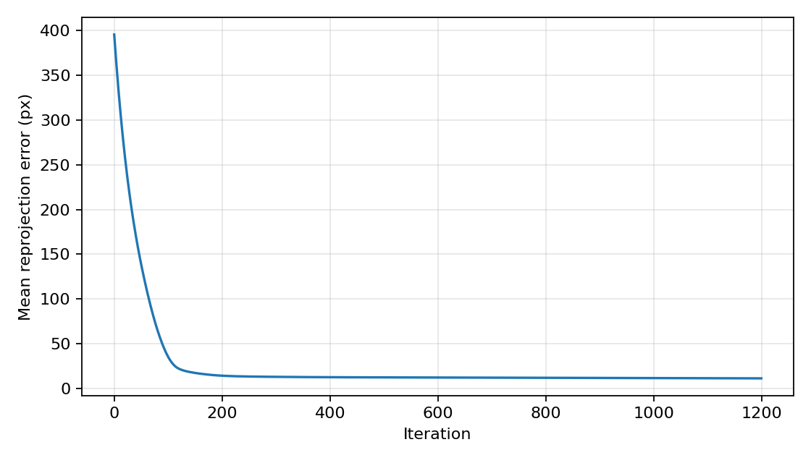
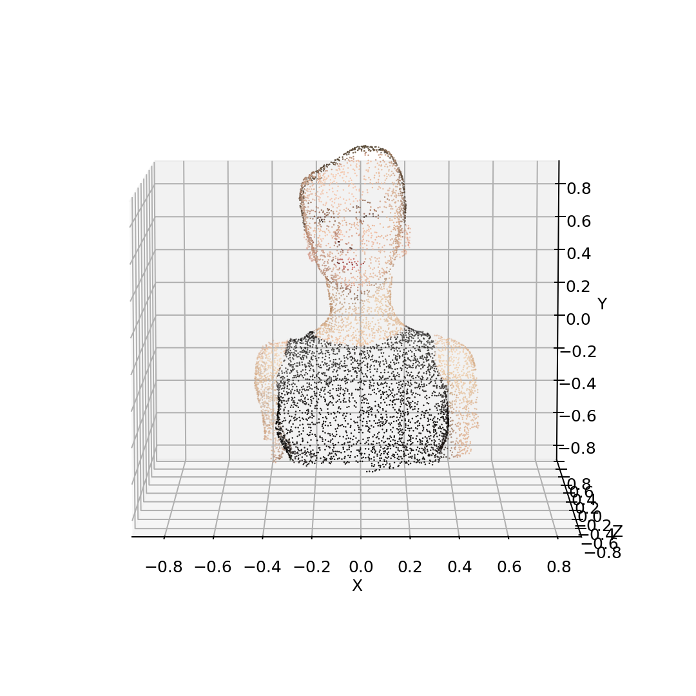

# Assignment 3 实验报告：Bundle Adjustment

## 1. 实验目标

本实验包含两个部分：

1. 使用 PyTorch 从二维观测中优化恢复三维点云、相机外参和共享焦距。
2. 使用 COLMAP 对 `data/images/` 中的 50 张多视角图像执行完整三维重建流程。

数据规模为 50 个视角、20000 个三维点。每个视角的二维观测存储在 `data/points2d.npz` 中，格式为 `(x, y, visibility)`。

## 2. Task 1：PyTorch Bundle Adjustment

### 2.1 方法

本实验新增实现文件为：

```text
bundle_adjustment.py
```

优化变量包括：

- 三维点坐标 `points3d`，形状为 `(20000, 3)`。
- 每个视角的 Euler 角旋转参数，形状为 `(50, 3)`。
- 每个视角的平移向量，形状为 `(50, 3)`。
- 所有相机共享的焦距 `f`。

相机坐标变换为：

```text
Xc = R @ X + T
```

投影模型为：

```text
u = -f * Xc / Zc + cx
v =  f * Yc / Zc + cy
```

其中图像尺寸为 `1024 x 1024`，所以 `cx = cy = 512`。旋转矩阵由 XYZ Euler 角手动实现，没有依赖 PyTorch3D。

优化目标为可见点的平均重投影误差：

```text
mean(||project(X, R, T, f) - observation||)
```

同时加入了很弱的中心约束和尺度约束，防止 BA 的尺度/平移自由度导致优化漂移。

### 2.2 初始化

初始化设置如下：

- 焦距初始化：`f = 900`
- 深度初始化：`Tz = -2.5`
- 三维点：根据各点在可见视角中的平均二维坐标做一次近似反投影，并加入少量随机扰动。
- 相机旋转：绕 Y 轴在 `[-55°, 55°]` 范围内线性初始化。

### 2.3 运行命令

实验运行命令：

```bash
C:\Users\yanyun\anaconda3\envs\dip_env\python.exe bundle_adjustment.py --iters 1200 --out-dir outputs/ba
```

数据可视化命令：

```bash
C:\Users\yanyun\anaconda3\envs\dip_env\python.exe visualize_data.py
```

### 2.4 实验结果

本次运行读取到：

- 视角数：50
- 三维点数：20000
- 可见二维观测数：805089
- 优化迭代数：1200

重投影误差：

| 指标 | 数值 |
|---|---:|
| 初始平均重投影误差 | 395.5424 px |
| 最终平均重投影误差 | 11.1754 px |
| 优化后焦距 | 1152.1138 |

Loss 曲线：



重建点云预览：



二维观测叠加示例：


### 2.5 输出文件

Task 1 已生成以下结果文件：

```text
outputs/ba/reconstruction.obj
outputs/ba/reconstruction.ply
outputs/ba/points3d.npy
outputs/ba/camera_euler_xyz.npy
outputs/ba/camera_translation.npy
outputs/ba/loss_curve.png
outputs/ba/point_cloud_preview.png
outputs/ba/metrics.json
```

其中 `reconstruction.obj` 每行顶点格式为：

```text
v x y z r g b
```

颜色来自 `data/points3d_colors.npy`。

## 3. Task 2：COLMAP 三维重建

### 3.1 方法与流程

作业提供的脚本为：

```text
run_colmap.sh
```

该脚本执行以下步骤：

1. `feature_extractor`
2. `exhaustive_matcher`
3. `mapper`
4. `image_undistorter`
5. `patch_match_stereo`
6. `stereo_fusion`

本机最初 `PATH` 中没有 COLMAP，conda 安装也未成功。因此本实验改用 COLMAP 官方 Windows 预编译包运行：

```text
tools/colmap_cuda/bin/colmap.exe
```

使用版本为：

```text
COLMAP 4.0.3 with CUDA
```

最终输出路径为：

```text
data/colmap/sparse/0/
data/colmap/dense/fused.ply
```

### 3.2 运行命令

特征提取：

```bash
tools\colmap_cuda\bin\colmap.exe feature_extractor --database_path data\colmap\database.db --image_path data\images --ImageReader.camera_model PINHOLE --ImageReader.single_camera 1
```

特征匹配：

```bash
tools\colmap_cuda\bin\colmap.exe exhaustive_matcher --database_path data\colmap\database.db
```

稀疏重建：

```bash
tools\colmap_cuda\bin\colmap.exe mapper --database_path data\colmap\database.db --image_path data\images --output_path data\colmap\sparse
```

图像去畸变与 dense workspace 生成：

```bash
tools\colmap_cuda\bin\colmap.exe image_undistorter --image_path data\images --input_path data\colmap\sparse\0 --output_path data\colmap\dense --output_type COLMAP
```

稠密深度估计：

```bash
tools\colmap_cuda\bin\colmap.exe patch_match_stereo --workspace_path data\colmap\dense --workspace_format COLMAP --PatchMatchStereo.max_image_size 1024 --PatchMatchStereo.gpu_index 0 --PatchMatchStereo.cache_size 16
```

稠密点云融合：

```bash
tools\colmap_cuda\bin\colmap.exe stereo_fusion --workspace_path data\colmap\dense --workspace_format COLMAP --input_type geometric --output_path data\colmap\dense\fused.ply
```

### 3.3 稀疏重建结果

COLMAP `mapper` 成功恢复 50 张图像的相机位姿，并生成稀疏三维点云。使用 `model_analyzer` 得到统计如下：

| 指标 | 数值 |
|---|---:|
| Cameras | 1 |
| Images | 50 |
| Registered images | 50 |
| Sparse points | 1646 |
| Observations | 13419 |
| Mean track length | 8.152491 |
| Mean observations per image | 268.380000 |
| Mean reprojection error | 0.611256 px |

稀疏重建输出文件包括：

```text
data/colmap/sparse/0/cameras.bin
data/colmap/sparse/0/images.bin
data/colmap/sparse/0/points3D.bin
data/colmap/sparse/0/frames.bin
data/colmap/sparse/0/rigs.bin
```

### 3.4 稠密重建结果

`image_undistorter` 成功生成 dense workspace，`patch_match_stereo` 对 50 张图像生成了深度图和法线图。随后使用 `stereo_fusion` 进行融合，输出文件为：

```text
data/colmap/dense/fused.ply
```

`fused.ply` 的 PLY 头部显示：

```text
element vertex 64737
```

因此最终稠密点云包含 64737 个顶点，文件大小约为 1.75 MB。

## 4. 总结

Task 1 已完成 PyTorch Bundle Adjustment 的从零实现，并生成带颜色点云、优化曲线和相机/三维点参数文件。优化后平均重投影误差从 `395.5424 px` 降到 `11.1754 px`。

Task 2 已使用 COLMAP 完成从多视角图像到三维重建的完整流程。稀疏重建注册了全部 50 张图像，得到 1646 个稀疏点，平均重投影误差为 `0.611256 px`；稠密融合生成 `data/colmap/dense/fused.ply`，包含 64737 个顶点。
